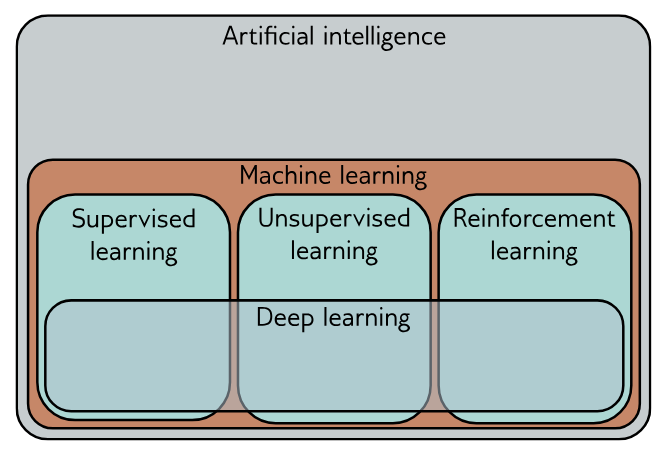

# AI Learning

## Introduction

This repository documents my journey learning Artificial Intelligence step by step. The goal is to build everything from scratch to truly understand how AI works under the hood, before moving to frameworks like PyTorch or TensorFlow.

  
I will start with deep learning, especially neural networks, in supervised learning.

## Topics

Each topic has its own folder with a dedicated README containing detailed explanations and learning progress:

- **[neural-networks/](neural-networks/)** - Neural networks from scratch: perceptrons, backpropagation, gradient descent visualizations

## Useful Resources

- [Understanding Deep Learning](https://udlbook.github.io/udlbook/)
- [Neural Networks and Deep Learning](http://neuralnetworksanddeeplearning.com/)
- [Transformer Explainer](https://poloclub.github.io/transformer-explainer/) - Interactive visualization of transformers
- [CNN Explainer](https://poloclub.github.io/cnn-explainer/) - Interactive visualization of CNNs
- [NN-SVG](https://alexlenail.me/NN-SVG/index.html) - Tool to create neural network architecture diagrams
