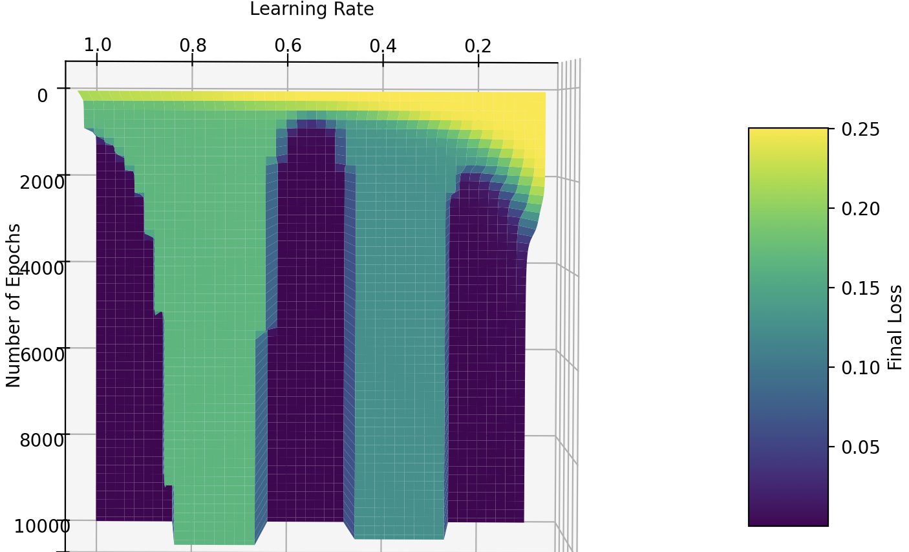

# Visualizations

## Gradient descent  
Interactive matplotlib visualizations to understand gradient descent.
- **1D Gradient Descent** (`gradient_descent_1d_interactive.py`): Visualize how gradient descent finds the minimum of a 1D function
- **2D Gradient Descent** (`gradient_descent_2d_interactive.py`): Compare Batch GD vs Stochastic GD on a loss surface with:
  - 3D surface plot
  - 2D contour plot
  - Interactive controls (learning rate, starting position, play/pause)  

  You can go to the code and choose to represent the 3D loss function and gradient of the 2 neurons network (`2_neurons_learning.py`)

## XOR 
(`xor_ablation_visualisation.py`)  
Visualize the impact of changing the number of epochs and the learning rate on the loss of the XOR model (`xor.py`). 

  

We can see that some learning rate are falling into local minimum and will never succeed to find the best weigths and biaises. The best range is from 0.5 and 0.6, reaching a perfect accuracy (near-zero loss) with a minimum of epochs.  

Note that this figure can change depending on the inital value of the parameters (weights and biaises).